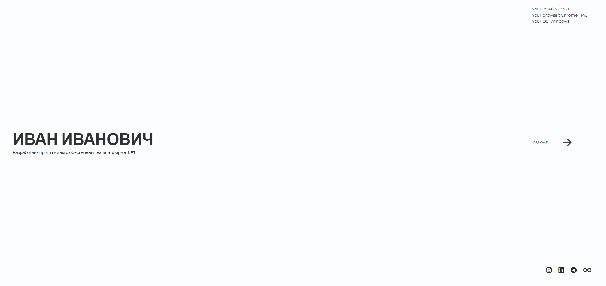
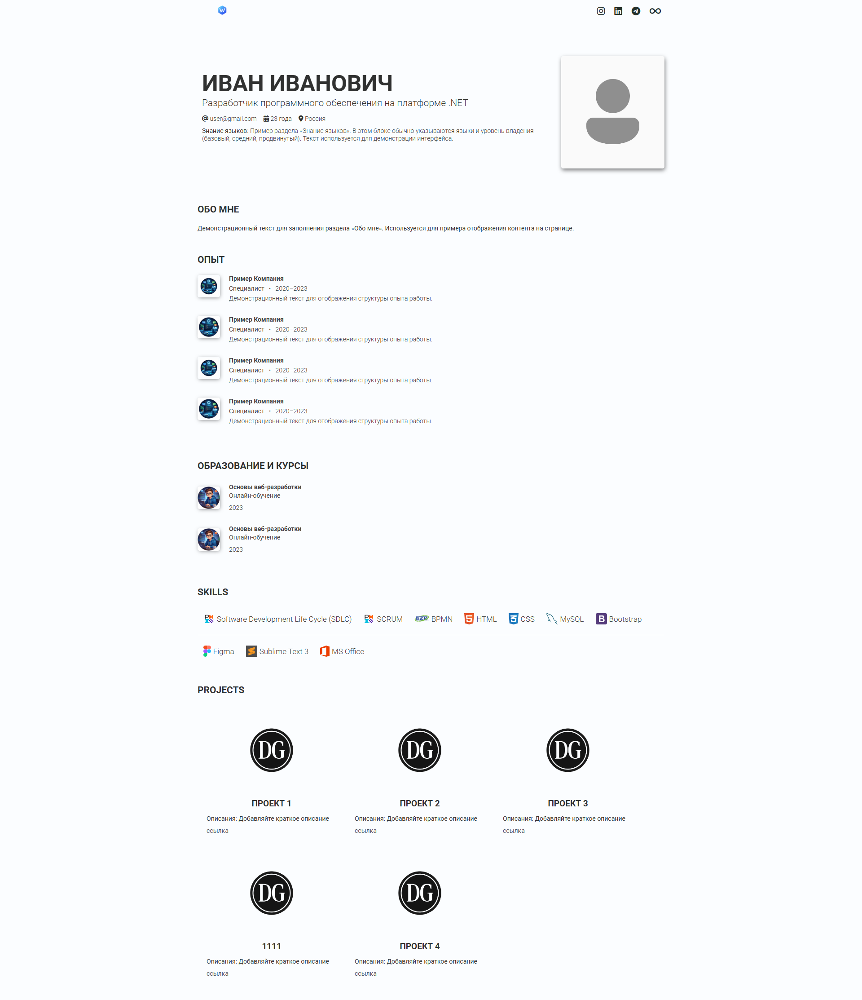

# Personal Portfolio Website

Личный сайт-портфолио веб-разработчика.

Сайт создан как простая и понятная веб-страница, где представлена информация обо мне, моих навыках и проектах.

## 📌 О проекте

Этот проект представляет собой демонстрационный сайт-портфолио, созданный в рамках практики веб-разработки.
Основная цель проекта — отработка структуры сайта, верстки и организации интерфейса. Проект используется как экспериментальная площадка для тестирования различных решений в разработке веб-страниц.
Основные цели проекта:

* показать мои навыки веб-разработки
* создать простую и удобную структуру сайта
* представить информацию обо мне и моих проектах

## 🛠 Используемые технологии

* HTML5
* CSS3
* JavaScript
* Bootstrap Grid

## 📂 Структура проекта

```
/css        — стили сайта
/js         — JavaScript файлы
/img        — изображения
index.html  — главная страница
about.html  — страница обо мне
```

## 🖼 Скриншот сайта





## 👨‍💻 Автор

Дмитрий Гербеев
Web Developer

Telegram
https://t.me/xelturon

VK
https://vk.com/dimgerb
